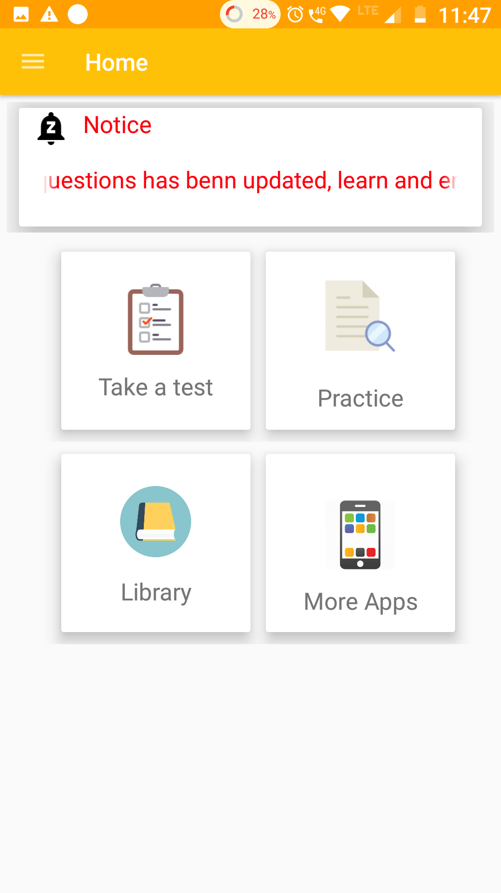
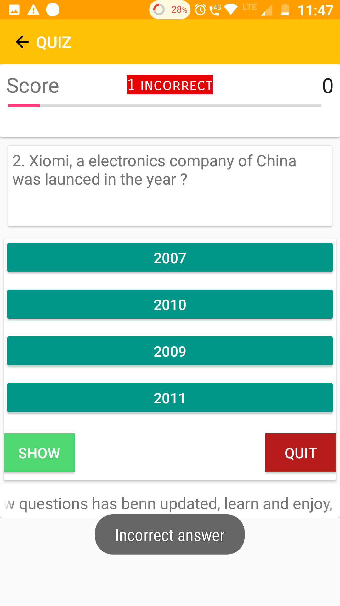

# quiZOL v1.2
This project was given as a project during 10 days summer training at MYWBUT training center, Kolkata, 2018
Note before installung in your system.

1-> As this app uses firebase, you have to create your own firebase project at firebase.console.com
2.>Add the dependencies and firebase Cloud messaging.
3.> Check at firebase cloud docs.
4->After successfuly added your own firebase, add all the files,then only run in your machine.
 Here  are some screenshots
 
 
 
 

Your contribution is welcome..

